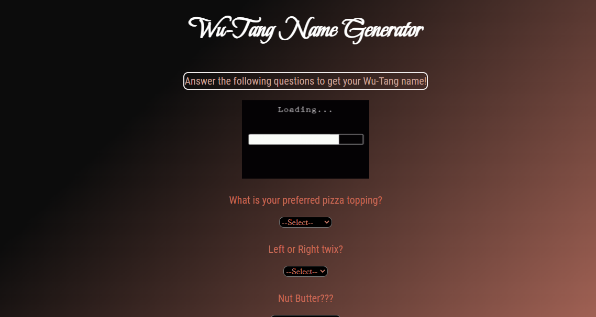

# 🎤 Week08 Bootcamp2019a Project: Wu-Tang Name Generator

### Goal: Create a Wu-Tang Clan name generator. Present the user with 5 survey questions and based on those answers randomly generate their name. The name doesn't have to be exact names, but Wu-Tang sounding-ish names. Ex: Childish Gambino (who actually got his name from a Wu-Tang name generator).

**Link to project: https://ddwutang.netlify.app/
 

 
## How It's Made:
 
**Tech used:** HTML, CSS, JavaScript
 
 
I utilized my skills in Node.js, javaScript, HTML and CSS to make this interactive application using arrays to store data which would further be used to serve a random name.By establishing a series of questions a user is allowed to note their preferences for a unique title.
## Lessons Learned:
I learned 'A regular expression is a sequence of characters that specify and certain search pattern.'